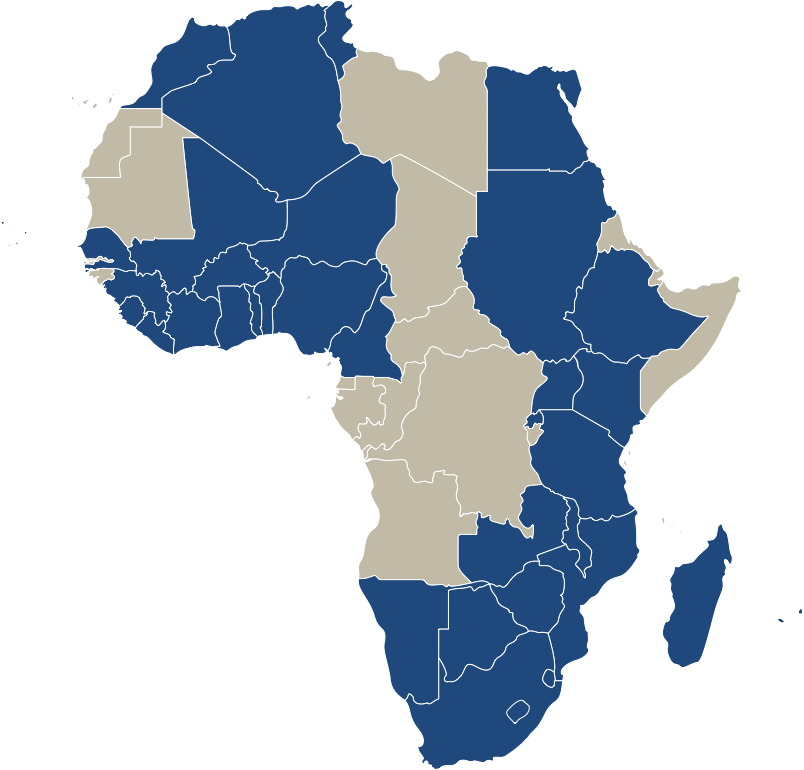

#### 1. Overview: Introduction & Policy Relevance, Research Question, Data Sources & Preliminary Structure of Collaborative Research Project

**Introduction & Policy Relevance:**
Tax evasion is considered a social malady across countries and is often thought to be one of the bigger obstacles to inclusive economic growth. High levels of evasion lead to a misallocation of resources and hinder the ability of the government to invest in the provision of public goods. Therefore, understanding the rationale driving tax evaders as well as tax compliers becomes essential to national development and state-building. Identifying and conceptualizing patterns will open the possibility for governments to effectively and efficiently tackle tax evasion. The current tax compliance literature lacks empirical evidence on the degree of tax morale in developing countries. This paper's aim therefore is to tap into this gap by studying tax morale in African countries. The paper will attempt to investigate the determinants that systemically affect tax morale using data for 34 African countries from the Afrobarmoeter.

**Research Question:** 
What are the determinants of tax morale in Africa?. 

**Data Sources:** 
The data we will use to investigate this question is provided by the [Afrobarometer](http://www.afrobarometer.org/) and freely available for the years 2015 (34 countries), 2008 (20 countries), 2005 (18 countries), 2004 (16 countries) and for the years 1999-2001 (12 countries). The data sets are available individually for the single years so some merging and cleaning of the data will be necessary before conducting the analysis.

The data is downloaded directly from the Afrobarometer's website into R using the following code:

```{r}
main <- rio::import("http://afrobarometer.org/sites/default/files/data/round-5/merged_r5_data_0.sav")
```


*(Additionally, we will gather data for the necessary control variables of our model from other data sources such as GDP, GDP per capita, measures of democracy and/or corruption; potential data sources: World Bank)*


**Preliminary Structure of the Final Paper for the Collaborative Research Project:**

1. Introduction

2. Literature Review

3. Data & Method

4. Results and Discussion

5. Conclusion

#### 2. Literature Review and Research Gap Identification
In 1972, Allingham and Sandmo presented a formal model explaining tax evasion as a negative correlation with the probability of detection and the degree of punishment [@Allingham1972] . According to their model, rational individuals should report virtually no income. In later years, their model turned out to have little explanatory power and failed to explain the high degree of tax compliance in some countries despite their low level of deterrence. This puzzle of tax compliance and the limitations of deterrence models led to an increasing literature acknowledging the need to consider other non-economic factors, such as psychological, moral and social factors. One widely used concept to be included in the economics of crime model is that of tax morale. Tax morale is often defined as “the existence of an intrinsic motivation to pay taxes” [@Torgler2005; @Torgler2009; @Cummings2009]. While there are many other definitions out there, this is the one most commonly used. Despite the absence of a common definition of tax morale, there seems to be an agreement on certain drivers, in particular social norms, values and trust and/or approval of the government seem to have an effect on tax morale. There is strong evidence that tax morale influences tax compliance of individual taxpayers 
[@Maciejovsky2012; @Molero2012; @Dulleck2012].One of the major shortcomings of the current literature debate is that little research has been conducted in developing countries. This research paper thus aims to (at least partially) close this gap by investigating the determinants of tax morale in African countries. 

#### 3. Research Design & Methods
*African countries, while different on their own, share certain characteristics, such as colonial past, that render them comparable (work on that argumentation)* For the purpose of this project – to analyse a region-, specific institutional and contextual characteristics of the countries will not play a prominent role. On the other hand, emphasis will be made on their shared socio-economic characteristic of being developing nations. The direct consequence of this is that they present low tax-effort indices – revenue collections to estimated revenue potentials – and, therefore, the importance to tackle tax evasion (and avoidance) becomes more urgent. **add tax effort graph Africa**

Moreover, identifying the determinants of tax morale could have interesting implications for policy interventions in compliance matters. For example, studies have shown that (pre-existing) deterrence mechanisms work better when there is a ‘social cost’ attached to them [@OECD]. With a thorough literature review, we will argue that this ‘social cost’ can be explained by tax morale. Subsequently, policy strategies aiming at increasing compliance should look at ways of increasing tax morale, appealing to the cooperative (complier) side of the sector, as opposed to increasing deterrence mechanisms which may have counter-intuitive effects – such as more evasion, even when the cost of defecting increases.

In order to carry out the analysis, we will use data from the Afrobarometer, an "African-led, non-partisan survey research project that measures citizen attitudes on democracy and governance, the economy, civil society, and other topics" (insert quote) The Afrobarometer's main donors for the survey rounds 5 and 6 included the Mo Ibrahim Foundation, the Swedish International Development Cooperation Agency, the Department for International Development, the United States Agency for International Development, as well as the World Bank. All interviews are conducted face-to-face and samples usually include either 1200 or 2400 cases per country).



**Figure 1: Countries included in the Afrobarometer**


**include information about the survey, the question we will use to measure tax morale as well as some basic information about the number of observations, countries etc.; find out how to include a picture in Markdown (make map of countries included)**

We will then perfom a regression analysis to investigate the determinants of tax morale in Africa.

# References
