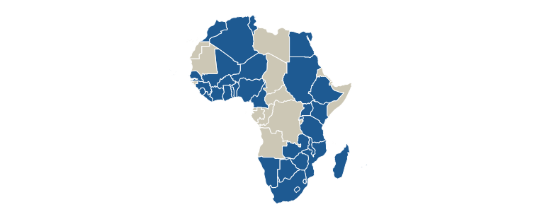

###1. Overview: Introduction & Policy Relevance, Research Question, Data Sources & Preliminary Structure of Collaborative Research Project

####Introduction & Policy Relevance:
Tax evasion is considered a social malady across countries and is often thought to be one of the bigger obstacles to inclusive economic growth. High levels of evasion lead to a misallocation of resources and hinder the ability of the government to invest in the provision of public goods. Therefore, understanding the rationale driving tax evaders as well as tax compliers becomes essential to national development and state-building. Identifying and conceptualizing patterns will open the possibility for governments to effectively and efficiently tackle tax evasion. The current tax compliance literature lacks empirical evidence on the degree of tax morale in developing countries. This paper's aim therefore is to tap into this gap by studying tax morale in African countries. The paper will attempt to investigate the determinants that systemically affect tax morale using data for 34 African countries from the Afrobarmoeter.

####Research Question:
What are the determinants of tax morale in Africa?

####Data Sources:
The data we will use to investigate this question is provided by the [Afrobarometer](http://www.afrobarometer.org/) and freely available for the years 2015 (34 countries), 2008 (20 countries), 2005 (18 countries), 2004 (16 countries) and for the years 1999-2001 (12 countries).

The data is downloaded directly from the Afrobarometer's website into R using the following code:

```{r}
main <- rio::import("http://afrobarometer.org/sites/default/files/data/round-5/merged_r5_data_0.sav")
```

####Preliminary Structure of the Final Paper for the Collaborative Research Project:

1. Introduction

2. Literature Review

3. Data & Method

4. Results and Discussion

5. Conclusion

###2. Literature Review and Research Gap Identification

In 1972, Allingham and Sandmo presented a formal model explaining tax evasion as a negative correlation with the probability of detection and the degree of punishment [@Allingham1972] . According to their model, rational individuals should report virtually no income. In later years, their model turned out to have little explanatory power and failed to explain the high degree of tax compliance in some countries despite their low level of deterrence. This puzzle of tax compliance and the limitations of deterrence models led to an increasing literature acknowledging the need to consider other non-economic factors, such as psychological, moral and social factors. One widely used concept to be included in the economics of crime model is that of tax morale. Tax morale is often defined as "the existence of an intrinsic motivation to pay taxes" [@Torgler2005; @Torgler2009; @Cummings2009]. While there are many other definitions out there, this is the one most commonly used. 

Despite the absence of a common definition of tax morale, there seems to be an agreement on certain drivers, in particular social norms, values and trust and/or approval of the government seem to have an effect on tax morale. Other factors commonly associated with potentially influencing tax morale are tax burden, which may lead to anti-tax feelings if considered too high; corruption might lead to "a crowding-out effect of morality"; perceived benefits from public spending may influence tax morale as there seems to be a "input-output relation between what an individual pays with his/her taxes and what comes back from the government" and fiscal knowledge might help "to put into account the connection between taxes and benefits" and thus positively influence tax morale [@Torgler2005, p.13]. There is strong evidence that tax morale influences tax compliance of individual taxpayers [@Maciejovsky2012; @Molero2012; @Dulleck2012].One of the major shortcomings of the current literature debate is that little research has been conducted in developing countries. This research paper thus aims to (at least partially) close this gap by investigating the determinants of tax morale in African countries. 

###3. Research Design & Methods

We reside with Torgler and believe that it "is important to analyse the determinants that influence tax morale in developing countries as the environment is different from developed countries", while on the other hand acknowledging that "some effects might be independent of cultural environments" [@Torgler2005, p.2].

One characteristic of developing countries is their usually low tax effort index, which further highlights the need to tackle tax evasion [^1].Identifying the determinants of tax morale could thus have interesting implications for policy interventions in compliance matters by opening new possibilities to tackle tax evasion which, depending on the policy, may turn out more cost efficient than tradtional deterrence mechanisms. 

In order to carry out the analysis, we will use data from the Afrobarometer, an "African-led, non-partisan survey research project that measures citizen attitudes on democracy and governance, the economy, civil society, and other topics" [@Afro]. The Afrobarometer's main donors for the survey rounds 5 and 6 (data on round 6 are not available yet) included the Mo Ibrahim Foundation, the Swedish International Development Cooperation Agency, the Department for International Development, the United States Agency for International Development, as well as the World Bank. 

 

We will operationalize tax morale by using the variable "People must pay taxes" from the dataset as the dependent variable. The information on this variable is obtained by asking the following question: "please tell me whether you disagree or agree: The tax authorities always have the right to make people pay taxes". The variable is coded as a categorical variable with values from 1 to 5 ("strongly disagree" to "strongly agree"). The questionnaire includes more variables that could be used to operationalize the dependent variable, but this particular variable has the advantage that it is asked in the same way for the waves of 2004, 2005, 2008 and 2015 (waves 2-5). 

We will test whether the commonly identified determinants of tax morale hold true for African countries as well; thus testing the influence of tax burden, corruption, benefits from public spending, fiscal knowledge, detection and punishment, moral costs and trust in government as determinants of tax morale. 

We will perform a multivariate regression analysis with year dummy variables. In accordance with some general findings from the tax morale literature we will control for socio-economic factors that have been found to be associated with the level of tax morale. These include for example gender (being female has been found to be associated with higher tax morale), age, education, employment status and being religious.

### References

[^1]: Tax effort is an index measure of how well a country is doing in terms of tax collection, relative to what could be reasonably expected given its economic potential.
