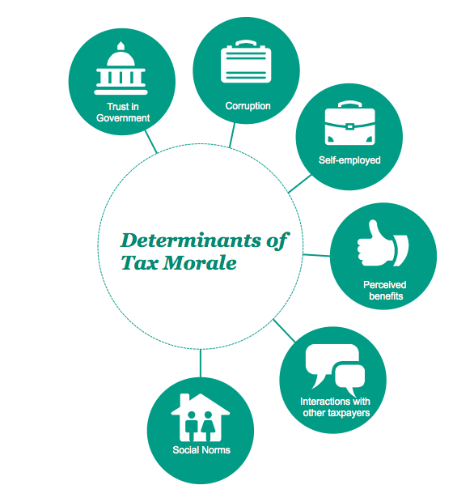

```{r, include=FALSE}
#setwd("C:/Users/Wiebke/Documents/RepRes/TaxMorale/Assignment 3/PreparatoryWork")
setwd("/Users/jasmincantzler/Documents/TaxMorale")
library(dplyr)
library(tidyr)
library(googleVis)
library(formattable)
library(ggplot2)
library(gdata)  

# Using the no factor one as we want to show the means in the map
# mydata <- read.csv('Afrobarometer.nofactors.csv')

#creates a subset with only Tax Morale and country
#summary_df <- mydata %>% 
#  group_by(Country) %>% 
#  summarise(
#    meantaxmorale = mean(TaxMorale, na.rm=TRUE)
#  )

# saved this subset in Excel to round numbers accordingly
# read the summary into R
newtry<- read.xls("Summary.xls")  

TaxMorale_map <- gvisGeoChart(newtry, locationvar = 'Country',
                      colorvar = 'meantaxmorale',
                      options = list(
                          colors = "['#a6611a','#dfc27d','#80cdc1','#018571']",
                          region= '002',
                          width=900, height=700))

```


**Tax morale could play a vital role in enhancing country's ability to efficiently mobilize national resources needed to invest in development, relieve poverty and deliver public services. Despite its potential, tax morale remains the underdog in enhancing tax compliance; most studies treat ‘tax morale’ as a black box without discussing or even considering how it might arise or how it might be maintained. We opened the box and present our findings and suggestions to policy makers in this post.**

```{r, echo=FALSE, results='asis'}
print(TaxMorale_map, tag = 'chart')
```
*Mean tax morale per country, using the Afrobarometer across Round 3 - Round 5; participants were asked whether "The tax department always has the right to make people pay taxes”. Respondents were offered 5 different options ranging from “strongly disagree” to “strongly agree” (low tax morale to high tax morale). The mean tax morale across these rounds was utilized for this graphic*

**Tax morale is an issue impinging Africa's development**

High levels of tax evasion lead to a misallocation of resources and hinder the ability of the government to invest in the provision of public goods. Therefore, understanding the rationale behind tax evaders becomes essential to national development and state building. 

Traditionally, the standard way to explain tax compliance has been the economics-of-crime approach, which assumes a rational taxpayer maximizing his or her utility by balancing the risk of detection and punishment with the benefit of tax evasion. In recent years there has been a revelation that this approach is too narrow to fully explain tax compliance and with this recognition came the awareness for a need to include more social factors. 

These social factors constitute and influence the individual’s “intrinsic motivation to pay taxes”; i.e. their tax morale. We set out to investigate the determinants of tax morale in African countries and found that these are not much different from what determines tax morale in other regions, such as Europe or the United States.

**The determinants of tax morale seem largely independent of cultural environments**



Trust in government and/or government officials is one of the classic factors influencing the tax compliance behavior of individuals. If people have no faith that their taxes are being fairly collected and spent, their desire to comply with applicable taxes is lowered. 

Similarly, corruption undermines tax morale by promoting a feeling of tax injustice; leading individuals to feel entitled to evade the taxes of an unfair system. Related to this feeling of injustice are interactions between taxpayers, which subsequently further influence and potentially erode or increase tax morale. Individuals who know of someone avoiding their taxes tend to have lower tax morale than others, whereas the knowledge that others are paying their taxes correspondingly can increase tax morale. 

The perception of the tax burden further seems to have an impact on tax morale:  self-employed individuals are especially prone to developing anti-tax feelings, as taxes are typically more visible to them and affect them more directly, which results in lower tax morale. 

Furthermore, strongly established social norms play a big role in determining the change of tax morale over time. Social dynamics- such as taxpayer interaction- become customary in the long-term, resulting in attitudes that become social norms.
Consequently, what becomes central to complying with official laws is not the regulation in itself, but the justification for doing so. 

**Policy makers should recognize the opportunity and implement polices that account for these insights**

With the understanding that fostering tax compliance is a multi-faceted undertaking, we urge policy makers to employ a portfolio of instruments to comprehensively approach tax evasion, which can broadly be divided into two categories: classical deterrence mechanisms and tax morale enhancing mechanisms. 

Tax morale enhancing mechanisms consist of mechanisms to increase tax morale by improving the tax administration and more generally by changing the tax culture through enhanced communication channels between the citizen and the tax administration, such as improving the communication between the taxadministration and the taxpayer, by decreasing compliance costs by keeping it smart and simple, by increasing accountability by illustrating that the government is providing "value for money" or by improving the choice architecture of the tax system.

There is a need for greater emphasis on policy tools that enhance tax morale and the importance of a holistic approach to combat tax evasion. There is a colorful potpourri of policy options that can enhance tax morale - we just need to start to use them!

**For further insights please see [here.](https://github.com/jasmincantzler/TaxMorale/blob/master/Final%20Project/Final.pdf)**
